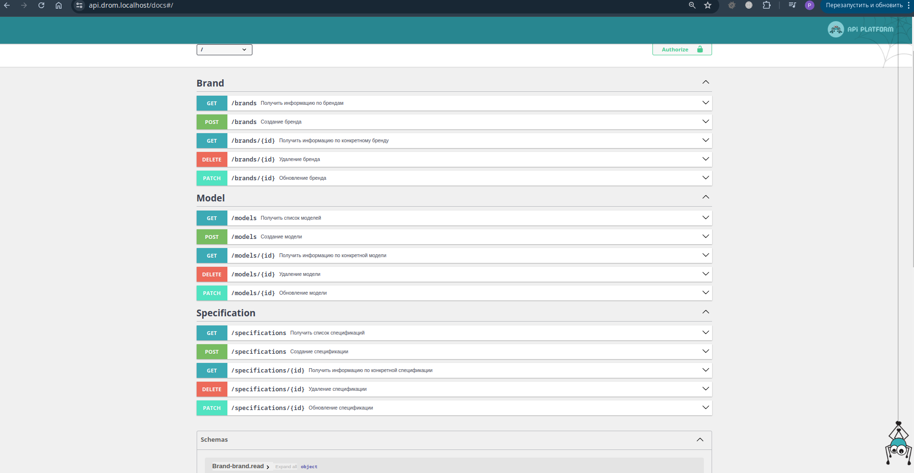

# Тестовое задание в команду Дром.Контент


## Описание проектного окружения

Проект состоит из нескольких сервисов, работающих через Docker:
1. **API-сервис** (`api`): Основной сервер, обрабатывающий запросы. API-документация доступна по адресу `https://api.drom.localhost/docs`.
2. **Traefik** (`traefik`): Реверс-прокси и балансировщик нагрузки, также обеспечивает HTTPS-доступ к сервисам.
3. **PostgreSQL** (`postgres`): База данных проекта, используется для хранения данных API.
4. **Adminer** (`adminer`): Утилита для управления базой данных через веб-интерфейс, доступна по адресу `https://adminer.drom.localhost`.

## Локальное окружение

### Установка Make (если не установлен)

Для автоматизации рабочего процесса на проекте используется Make-файл. Если `make` не установлен, выполните следующие шаги:

- **Ubuntu/Debian:**
  ```bash
  sudo apt update && sudo apt install -y make
- **MacOS:**
  ```bash
  brew install make
- **Windows: Можно использовать WSL или Cygwin для работы с make. Либо установите make через Chocolatey:**
  ```bash
  choco install make

### Подготовка локального окружения
#### Генерация SSL-сертификата

Для генерации SSL-сертификата используйте [mkcert](https://github.com/FiloSottile/mkcert). Это помогает создать сертификаты для локального домена `drom.localhost` и поддоменов.

```bash
mkcert \
  -key-file docker/traefik/certs/key.pem \
  -cert-file docker/traefik/certs/cert.pem \
  drom.localhost '*.drom.localhost'
```

### Настройка алиаса для Make

Рекомендуется добавить алиас для команды `make` в конфигурацию `.bashrc` или `.zshrc` для удобства:

```bash
alias m='make -s --'
```
В тексте далее будет использоваться данный алиас **m**.

### Запуск локального окружения
#### Запуск окружения

Чтобы запустить проект с помощью Docker, выполните:

```bash
m start
```
Установите зависимости через Composer:
```bash
m composer install
```

### CI/CD
#### Тестирование в GitHub Actions
GitHub Actions настраивается для автоматизации тестирования и запуска команд для базы данных и тестов. Файл .github/workflows/ci.yml содержит необходимые шаги, включая инициализацию базы данных и запуск тестов.

#### Команды для управления проектом
Инициализация базы данных с тестовыми данными
```bash
m initdb
```

Запуск тестов с PHPUnit
```bash
m phpunit
```
**Примечание:** Эти команды вызывают Docker-контейнеры и запускают команды внутри контейнеров для более точного тестирования.

## Дополнительные задания

### Аналитический SQL-запрос
Запрос на выборку данных о брендах с мощностью автомобилей больше 200 л.с.

```sql
SELECT
    brand.name AS brand_name,
    AVG(spec.power) AS average_power
FROM
    brands AS brand
JOIN
    models AS model ON brand.id = model.brand_id
JOIN
    specifications AS spec ON model.id = spec.model_id
GROUP BY
    brand.name
HAVING
    AVG(spec.power) > 200;
```
## Документация API

Основной интерфейс документации API доступен по адресу [https://api.drom.localhost/docs](https://api.drom.localhost/docs).

Документация генерируется автоматически с использованием [API Platform](https://api-platform.com/) и предоставляет удобный интерфейс для тестирования всех доступных API-методов.

### Пример документации API


